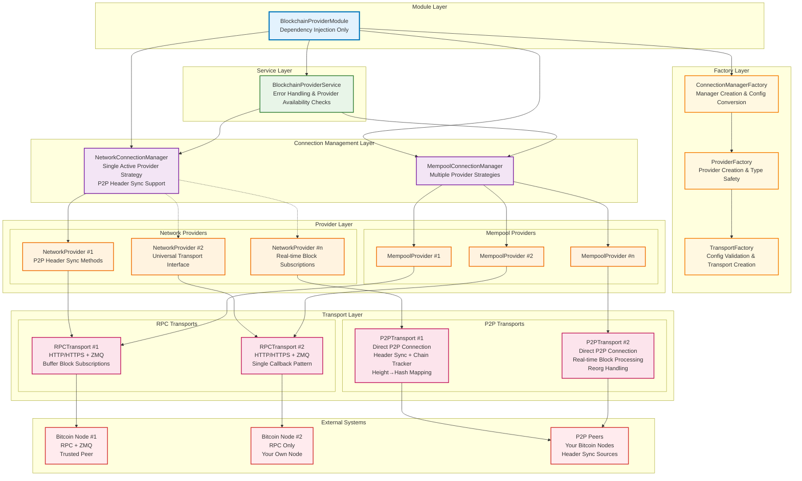

# Blockchain Provider Architecture

## Overview
Multi-layer architecture for working with Bitcoin blockchain via various transports (RPC/P2P) with automatic failover and support for various strategies for mempool operations. The architecture emphasizes type safety, configuration validation at factory level, and proper separation of concerns.

## Architecture Diagram



## Layer Responsibilities

### 🔵 Module Layer
- **BlockchainProviderModule** - Pure dependency injection container
- No configuration validation logic
- Always creates connection managers (even with empty provider arrays)
- Delegates all configuration processing to factories
- Clean separation between DI and business logic

### 🟡 Factory Layer
- **TransportFactory** - Transport creation and configuration validation
  - Validates RPC/P2P configurations with detailed error messages
  - P2P header sync configuration validation (maxHeight, headerSyncEnabled, headerSyncBatchSize)
  - Type-safe transport creation with proper generic constraints
  - Handles `uniqName` generation and requirement enforcement
  - Extensible for new transport types
  
- **ProviderFactory** - Provider creation with strong typing
  - Creates properly typed `NetworkProvider` and `MempoolProvider` instances
  - Generic factory methods with compile-time type safety
  - Reusable across different provider configurations
  
- **ConnectionManagerFactory** - Manager creation and config conversion
  - Converts module configurations to transport configurations
  - Handles the bridge between module config format and factory requirements
  - Creates properly typed connection managers

### 🟢 Service Layer
- **BlockchainProviderService** - Unified API with provider availability checks
- Enforces provider availability before operations (`ensureNetworkProviders()`, `ensureMempoolProviders()`)
- P2P sync status monitoring (`getP2PSyncStatus()`, `waitForP2PHeaderSync()`)
- P2P-aware height operations with sync options
- Provides meaningful error messages when no providers are configured
- Data normalization from Universal objects to component types
- Real-time block subscription management (single callback pattern)
- API for blocks, transactions, blockchain stats, and mempool operations

### 🟣 Connection Management Layer
- **NetworkConnectionManager** - Single active provider management
  - **Type**: `BaseConnectionManager<NetworkProvider>`
  - Strategy: One active provider with automatic failover
  - P2P provider initialization with header sync support
  - P2P status monitoring across all providers
  - Round-robin provider switching on failures with P2P-aware switching
  - Connection health monitoring and recovery
  
- **MempoolConnectionManager** - Multiple provider strategy management
  - **Type**: `BaseConnectionManager<MempoolProvider>`
  - Strategies: `parallel`, `round-robin`, `fastest`, `single`
  - Load balancing and retry logic
  - Provider statistics and failure state management

### 🟠 Provider Layer
- **NetworkProvider** - Network operations business logic
  - **Base**: `BaseProvider` with `NetworkConfig` specialization
  - Methods for blocks, transactions, blockchain info
  - P2P-specific initialization methods (`initializeP2P()`, `getP2PStatus()`)
  - Universal transport interface (works with both RPC and P2P)
  - Real-time block subscriptions with Buffer→UniversalBlock parsing
  - Merkle root verification capabilities
  
- **MempoolProvider** - Mempool operations business logic
  - **Base**: `BaseProvider` with mempool specialization
  - Mempool-specific methods only
  - Fee estimation capabilities
  - Mempool entry management

### 🟣 Transport Layer
- **RPCTransport** - HTTP/HTTPS + ZMQ connections
  - Batch RPC call optimization
  - Authentication and rate limiting
  - ZMQ subscriptions with single callback pattern
  - Real-time block notifications via Buffer callbacks
  - Connection timeout and retry handling
  
- **P2PTransport** - Direct P2P network connections
  - Automatic header synchronization on connect
  - ChainTracker for height→hash mapping (~60MB for 870k blocks)
  - Support for `getManyBlockHashesByHeights()` and `getBlockHeight()` via chain tracker
  - Real-time block processing with automatic height calculation
  - Blockchain reorganization detection and handling
  - Configurable sync parameters (maxHeight, batchSize, sync enabled/disabled)
  - Single block subscription callback (not stored, passed through)
  - Peer management and connection pooling
  - Direct message handling with Bitcoin protocol
  - Block request optimization via GetData messages
  - Network-level failover

### 🔴 External Systems
- **Bitcoin Nodes** - RPC servers with optional ZMQ push notifications
- **P2P Network** - Direct connections to your own Bitcoin nodes (trusted peers)
- Header sync sources for building complete blockchain index

## Transport Method Architecture

### Core Transport Methods
```typescript
// Universal RPC method
batchCall(): Promise<(T | null)[]>          // JSON structures, null support

// Specialized hex block method  
requestHexBlocks(): Promise<Buffer[]>        // Raw block data, throws on missing

// Specialized hash lookup
getManyBlockHashesByHeights(): Promise<(string | null)[]>  // Hash lookup, null support

// Current height
getBlockHeight(): Promise<number>            // Current height, throws on missing
```

### Provider Method Mapping
```typescript
// JSON blocks via transport.batchCall()
getManyBlocksByHashes()     → batchCall([{method: 'getblock', params: [hash, verbosity]}])

// Hex blocks via transport.requestHexBlocks()
getManyBlocksHexByHashes()  → requestHexBlocks(hashes) → HexTransformer.parseBlockHex()

// Combined: hash lookup + block retrieval
getManyBlocksByHeights()    → getManyBlockHashesByHeights() + getManyBlocksByHashes()

// Transaction methods
getManyTransactionsByTxids()    → batchCall([{method: 'getrawtransaction', params: [txid, verbosity]}])
getManyTransactionsHexByTxids() → batchCall([{method: 'getrawtransaction', params: [txid, false]}])
```

## Data Flow Examples

### P2P Header Synchronization Flow
```
P2P Transport Connect
    ↓
Automatic Header Sync Start (Background)
    ↓
Request Headers from Trusted Peer (GetHeaders messages)
    ↓
Parse 80-byte Bitcoin Headers
    ↓
Build Height→Hash Mapping in ChainTracker
    ↓
Continue until Tip Reached (< 2000 headers response)
    ↓
Header Sync Complete (~60MB memory for full chain)
    ↓
Ready for Height-based Operations
```

### P2P Real-time Block Processing
```
New Block Received (P2P 'block' event)
    ↓
Extract Block Buffer
    ↓
Pass to Subscription Callback (if exists)
    ↓
Parse Previous Block Hash
    ↓
Calculate Height from ChainTracker
    ↓
Add to ChainTracker (Auto Reorg Detection)
    ↓
Height→Hash Mapping Updated
```

### Network Operations Flow (Universal)
```
User Request (e.g., getOneBlockByHeight(100))
    ↓
BlockchainProviderService.ensureNetworkProviders()
    ↓
NetworkConnectionManager.getActiveProvider()
    ↓
NetworkProvider (Universal Interface)
    ↓
if P2P: getManyBlockHashesByHeights([100]) via ChainTracker
    ↓
if P2P: requestHexBlocks([hash]) via GetData message
    ↓
if RPC: batchCall([{method: 'getblockhash'}, {method: 'getblock'}])
    ↓
Parse & Return UniversalBlock
```

### Real-time Block Subscription Flow
```
Service.subscribeToNewBlocks(callback)
    ↓
NetworkProvider.subscribeToNewBlocks(buffer => {
        parse buffer to UniversalBlock,
        call service callback
    })
    ↓
Transport.subscribeToNewBlocks(bufferCallback)
    ↓
if P2P: single callback stored, blocks passed through immediately
    ↓
if RPC: ZMQ subscription with callback set
    ↓
Real-time blocks → Buffer → UniversalBlock → Service Callback
```

### Order Guarantees & Null Handling

#### Transport Level
```typescript
// RPC Transport: UUID matching preserves order
batchCall([req_A, req_B, req_C]) → [result_A, null, result_C]  // B failed

// P2P Transport: Position mapping preserves order  
getManyBlockHashesByHeights([100, 999999, 200]) → [hash_100, null, hash_200]  // 999999 missing
```

#### Provider Level
```typescript
// Graceful normalization with try-catch → null
getManyBlocksByHashes([hash1, corrupted, hash3]) → [Block, null, Block]  // corrupted fails parsing
```

#### Service Level
```typescript
// Filters out nulls for clean API
getManyBlocksByHeights([100, 999999, 200]) → [Block_100, Block_200]  // null filtered out
```

## Configuration Examples

### P2P Network Configuration
```typescript
BlockchainProviderModule.forRootAsync({
  networkProviders: {
    type: 'p2p',
    connections: [{
      peers: [
        { host: '192.168.1.100', port: 8333 }, // Your Bitcoin node
        { host: '192.168.1.101', port: 8333 }  // Backup node
      ],
      maxPeers: 4,
      connectionTimeout: 30000,
      maxBatchSize: 2000,
      // Header sync configuration
      headerSyncEnabled: true,        // Enable automatic header sync
      headerSyncBatchSize: 2000,      // Headers per batch request
      maxHeight: undefined,           // Sync all headers (no limit)
      uniqName: 'p2p-trusted-nodes'
    }]
  },
  mempoolProviders: {
    type: 'rpc', // Use RPC for mempool operations
    connections: [
      { baseUrl: 'http://192.168.1.100:8332', uniqName: 'mempool-rpc' }
    ]
  },
  network: networkConfig,
  rateLimits: rateLimits
});
```

### Mixed Transport Configuration
```typescript
BlockchainProviderModule.forRootAsync({
  networkProviders: {
    type: 'p2p',
    connections: [{
      peers: [
        { host: '10.0.0.1', port: 8333 },
        { host: '10.0.0.2', port: 8333 },
        { host: '10.0.0.3', port: 8333 }
      ],
      maxPeers: 8,
      headerSyncEnabled: true,
      uniqName: 'p2p-network-cluster'
    }]
  },
  mempoolProviders: {
    type: 'rpc',
    connections: [
      { 
        baseUrl: 'http://fast-mempool:8332',
        zmqEndpoint: 'tcp://fast-mempool:28332',
        uniqName: 'fast-mempool'
      },
      { 
        baseUrl: 'http://reliable-mempool:8332',
        uniqName: 'reliable-mempool'
      }
    ],
    defaultStrategy: 'parallel'
  },
  network: networkConfig,
  rateLimits: rateLimits
});
```

## Service API Examples

### P2P Sync Status Monitoring
```typescript
// Check P2P synchronization status
const syncStatus = await service.getP2PSyncStatus();
console.log('P2P providers:', syncStatus.hasP2PProviders);
console.log('Sync progress:', syncStatus.providers[0].syncProgress);

// Wait for header sync completion (optional)
await service.waitForP2PHeaderSync(300000); // 5 minute timeout

// Initialize P2P with sync wait
await service.initializeP2PProvider({
  waitForHeaderSync: true,
  headerSyncTimeout: 60000
});
```

### Block Operations with Strategy Selection
```typescript
// Get blocks with hex parsing for performance
const blocks = await service.getManyBlocksByHeights(
  [100, 200, 300], 
  true,  // useHex = true (requestHexBlocks + HexTransformer)
  1,     // verbosity (ignored for hex)
  false  // verifyMerkle
);

// Get blocks with JSON for debugging
const blocksJson = await service.getManyBlocksByHeights(
  [100, 200, 300],
  false, // useHex = false (batchCall + normalization)
  2,     // verbosity = 2 (full transaction objects)
  true   // verifyMerkle = true
);
```

### Real-time Block Subscriptions
```typescript
// Works with both RPC (ZMQ) and P2P transports
const subscription = service.subscribeToNewBlocks((block: Block) => {
  console.log('New block:', block.height, block.hash);
  // Block includes height regardless of transport type
});

// Unsubscribe
subscription.unsubscribe();
await subscription; // Promise resolves when unsubscribed
```

## Key Architectural Benefits

### ✅ **Clear Method Naming**
- `requestHexBlocks()` - Clearly indicates hex block data as Buffer[]
- `batchCall()` - Universal RPC access for JSON responses
- `getManyBlockHashesByHeights()` - Explicit hash lookup functionality

### ✅ **Order Guarantees**
- **RPC**: UUID matching preserves request-response order
- **P2P**: Position mapping maintains array order
- **Providers**: Map operations preserve relationships
- **Service**: Filters maintain original relationships

### ✅ **Consistent Null Handling**
- **Transport**: Returns null for missing/failed items in batch operations
- **Provider**: Graceful normalization with try-catch → null fallback
- **Service**: Filters nulls for clean consumer API

### ✅ **Performance Optimizations**
- **Hex vs JSON**: Choose optimal data format per use case
- **Batch Operations**: Minimize network round-trips
- **P2P Direct Access**: Bypass RPC layer for blockchain operations
- **Memory Efficient**: ChainTracker uses only ~60MB for full Bitcoin chain

### ✅ **Type Safety & Extensibility**
- **Transport Level**: Generic factory methods with proper constraints
- **Provider Level**: Strongly typed business logic
- **Service Level**: Clean, typed API for consumers
- **Configuration**: Detailed validation with specific error messages

### ✅ **Graceful Degradation**
- **Empty Configurations**: Managers created, operations fail with clear messages
- **P2P Partial Sync**: Transport functional even with incomplete header sync
- **Provider Failures**: Automatic failover with connection management
- **Missing Data**: Null handling preserves operation continuity

## P2P Transport Technical Details

### Header Synchronization Process
1. **Connection**: P2P transport connects to trusted Bitcoin peers
2. **GetHeaders**: Sends GetHeaders messages with block locators
3. **Processing**: Receives up to 2000 headers per batch
4. **Parsing**: Parses 80-byte Bitcoin headers to extract hash and previous hash
5. **Mapping**: Builds sequential height→hash mapping starting from genesis
6. **Completion**: Continues until receiving < 2000 headers (reached tip)
7. **Memory**: ~72 bytes per block = ~60MB for complete Bitcoin blockchain

### Chain Tracker Architecture
```typescript
class ChainTracker {
  private heightToHash: Map<number, string>; // Core mapping
  private tipHeight: number;                 // Current chain tip
  
  // Reorg handling: automatically detects conflicts and rebuilds chain
  addHeader(hash: string, height: number): boolean;
  
  // Fast lookups for height-based operations
  getHash(height: number): string | undefined;
  getManyHashes(heights: number[]): (string | null)[];
}
```

### Real-time Block Processing
- **Immediate Processing**: New blocks processed as they arrive via P2P
- **Height Calculation**: Uses previousblockhash to determine height from chain tracker
- **Chain Updates**: Automatically updates height→hash mapping
- **Reorg Detection**: Identifies conflicting blocks at same height
- **Subscription Pass-through**: Blocks immediately forwarded to subscribers

This architecture provides a robust, type-safe, and high-performance foundation for Bitcoin blockchain operations with both traditional RPC and modern P2P connectivity options.