# Blockchain Provider Architecture

## Overview
Multi-layer architecture for working with Bitcoin blockchain via various transports (RPC/P2P) with automatic failover and support for various strategies for mempool operations. The architecture emphasizes type safety, configuration validation at factory level, and proper separation of concerns.

## Architecture Diagram

```mermaid
graph TB
    %% Module Layer
    subgraph "Module Layer"
        MODULE[BlockchainProviderModule<br/>Dependency Injection Only]
    end

    %% Factory Layer
    subgraph "Factory Layer"
        TCF[TransportFactory<br/>Config Validation & Transport Creation]
        PCF[ProviderFactory<br/>Provider Creation & Type Safety]
        CMF[ConnectionManagerFactory<br/>Manager Creation & Config Conversion]
    end

    %% Service Layer
    subgraph "Service Layer"
        BPS[BlockchainProviderService<br/>Error Handling & Provider Availability Checks]
    end

    %% Connection Management Layer
    subgraph "Connection Management Layer"
        NCM[NetworkConnectionManager<br/>Single Active Provider Strategy<br/>P2P Header Sync Support]
        MCM[MempoolConnectionManager<br/>Multiple Provider Strategies]
    end

    %% Provider Layer
    subgraph "Provider Layer"
        subgraph "Network Providers"
            NP1[NetworkProvider #1<br/>P2P Header Sync Methods]
            NP2[NetworkProvider #2<br/>Universal Transport Interface]
            NPn[NetworkProvider #n<br/>Real-time Block Subscriptions]
        end
        
        subgraph "Mempool Providers"
            MP1[MempoolProvider #1]
            MP2[MempoolProvider #2]
            MPn[MempoolProvider #n]
        end
    end

    %% Transport Layer
    subgraph "Transport Layer"
        subgraph "RPC Transports"
            RPC1[RPCTransport #1<br/>HTTP/HTTPS + ZMQ<br/>Buffer Block Subscriptions]
            RPC2[RPCTransport #2<br/>HTTP/HTTPS + ZMQ<br/>Single Callback Pattern]
        end
        
        subgraph "P2P Transports"
            P2P1[P2PTransport #1<br/>Direct P2P Connection<br/>Header Sync + Chain Tracker<br/>Height→Hash Mapping]
            P2P2[P2PTransport #2<br/>Direct P2P Connection<br/>Real-time Block Processing<br/>Reorg Handling]
        end
    end

    %% External Systems
    subgraph "External Systems"
        NODE1[Bitcoin Node #1<br/>RPC + ZMQ<br/>Trusted Peer]
        NODE2[Bitcoin Node #2<br/>RPC Only<br/>Your Own Node]
        PEERS[P2P Peers<br/>Your Bitcoin Nodes<br/>Header Sync Sources]
    end

    %% Factory Flow
    MODULE --> CMF
    CMF --> PCF
    PCF --> TCF
    
    %% Service Connections
    MODULE --> BPS
    MODULE --> NCM
    MODULE --> MCM
    
    BPS --> NCM
    BPS --> MCM
    
    %% Provider Connections
    NCM --> NP1
    NCM -.-> NP2
    NCM -.-> NPn
    
    MCM --> MP1
    MCM --> MP2
    MCM --> MPn
    
    %% Transport Connections
    NP1 --> RPC1
    NP2 --> RPC2
    NPn --> P2P1
    
    MP1 --> RPC1
    MP2 --> RPC2
    MPn --> P2P2
    
    %% External Connections
    RPC1 --> NODE1
    RPC2 --> NODE2
    P2P1 --> PEERS
    P2P2 --> PEERS

    %% Styling
    classDef moduleLayer fill:#e3f2fd,stroke:#0277bd,stroke-width:3px
    classDef factoryLayer fill:#fff8e1,stroke:#f57c00,stroke-width:2px
    classDef serviceLayer fill:#e8f5e8,stroke:#2e7d32,stroke-width:2px
    classDef managementLayer fill:#f3e5f5,stroke:#7b1fa2,stroke-width:2px
    classDef providerLayer fill:#fff3e0,stroke:#ef6c00,stroke-width:2px
    classDef transportLayer fill:#fce4ec,stroke:#c2185b,stroke-width:2px
    classDef externalLayer fill:#ffebee,stroke:#d32f2f,stroke-width:2px

    class MODULE moduleLayer
    class TCF,PCF,CMF factoryLayer
    class BPS serviceLayer
    class NCM,MCM managementLayer
    class NP1,NP2,NPn,MP1,MP2,MPn providerLayer
    class RPC1,RPC2,P2P1,P2P2 transportLayer
    class NODE1,NODE2,PEERS externalLayer
```



## Layer Responsibilities

### 🔵 Module Layer
- **BlockchainProviderModule** - Pure dependency injection container
- No configuration validation logic
- Always creates connection managers (even with empty provider arrays)
- Delegates all configuration processing to factories
- Clean separation between DI and business logic

### 🟡 Factory Layer
- **TransportFactory** - Transport creation and configuration validation
  - Validates RPC/P2P configurations with detailed error messages
  - **NEW**: P2P header sync configuration validation (maxHeight, headerSyncEnabled, headerSyncBatchSize)
  - Type-safe transport creation with proper generic constraints
  - Handles `uniqName` generation and requirement enforcement
  - Extensible for new transport types
  
- **ProviderFactory** - Provider creation with strong typing
  - Creates properly typed `NetworkProvider` and `MempoolProvider` instances
  - Generic factory methods with compile-time type safety
  - Reusable across different provider configurations
  
- **ConnectionManagerFactory** - Manager creation and config conversion
  - Converts module configurations to transport configurations
  - Handles the bridge between module config format and factory requirements
  - Creates properly typed connection managers

### 🟢 Service Layer
- **BlockchainProviderService** - Unified API with provider availability checks
- Enforces provider availability before operations (`ensureNetworkProviders()`, `ensureMempoolProviders()`)
- **NEW**: P2P sync status monitoring (`getP2PSyncStatus()`, `waitForP2PHeaderSync()`)
- **NEW**: P2P-aware height operations with sync options
- Provides meaningful error messages when no providers are configured
- Data normalization from Universal objects to component types
- **ENHANCED**: Real-time block subscription management (single callback pattern)
- API for blocks, transactions, blockchain stats, and mempool operations

### 🟣 Connection Management Layer
- **NetworkConnectionManager** - Single active provider management
  - **Type**: `BaseConnectionManager<NetworkProvider>`
  - Strategy: One active provider with automatic failover
  - **NEW**: P2P provider initialization with header sync support
  - **NEW**: P2P status monitoring across all providers
  - Round-robin provider switching on failures with P2P-aware switching
  - Connection health monitoring and recovery
  
- **MempoolConnectionManager** - Multiple provider strategy management
  - **Type**: `BaseConnectionManager<MempoolProvider>`
  - Strategies: `parallel`, `round-robin`, `fastest`, `single`
  - Load balancing and retry logic
  - Provider statistics and failure state management

### 🟠 Provider Layer
- **NetworkProvider** - Network operations business logic
  - **Base**: `BaseProvider` with `NetworkConfig` specialization
  - Methods for blocks, transactions, blockchain info
  - **NEW**: P2P-specific initialization methods (`initializeP2P()`, `getP2PStatus()`)
  - **ENHANCED**: Universal transport interface (works with both RPC and P2P)
  - **ENHANCED**: Real-time block subscriptions with Buffer→UniversalBlock parsing
  - Merkle root verification capabilities
  
- **MempoolProvider** - Mempool operations business logic
  - **Base**: `BaseProvider` with mempool specialization
  - Mempool-specific methods only
  - Fee estimation capabilities
  - Mempool entry management

### 🟣 Transport Layer
- **RPCTransport** - HTTP/HTTPS + ZMQ connections
  - Batch RPC call optimization
  - Authentication and rate limiting
  - **ENHANCED**: ZMQ subscriptions with single callback pattern
  - **ENHANCED**: Real-time block notifications via Buffer callbacks
  - Connection timeout and retry handling
  
- **P2PTransport** - Direct P2P network connections
  - **NEW**: Automatic header synchronization on connect
  - **NEW**: ChainTracker for height→hash mapping (~60MB for 870k blocks)
  - **NEW**: Support for `getManyBlockHashesByHeights()` and `getBlockHeight()` via chain tracker
  - **NEW**: Real-time block processing with automatic height calculation
  - **NEW**: Blockchain reorganization detection and handling
  - **NEW**: Configurable sync parameters (maxHeight, batchSize, sync enabled/disabled)
  - **ENHANCED**: Single block subscription callback (not stored, passed through)
  - Peer management and connection pooling
  - Direct message handling with Bitcoin protocol
  - Block request optimization via GetData messages
  - Network-level failover

### 🔴 External Systems
- **Bitcoin Nodes** - RPC servers with optional ZMQ push notifications
- **P2P Network** - **Enhanced**: Direct connections to your own Bitcoin nodes (trusted peers)
- **NEW**: Header sync sources for building complete blockchain index

## Enhanced Data Flow Examples

### P2P Header Synchronization Flow (NEW)
```
P2P Transport Connect
    ↓
Automatic Header Sync Start (Background)
    ↓
Request Headers from Trusted Peer (GetHeaders messages)
    ↓
Parse 80-byte Bitcoin Headers
    ↓
Build Height→Hash Mapping in ChainTracker
    ↓
Continue until Tip Reached (< 2000 headers response)
    ↓
Header Sync Complete (~60MB memory for full chain)
    ↓
Ready for Height-based Operations
```

### P2P Real-time Block Processing (NEW)
```
New Block Received (P2P 'block' event)
    ↓
Extract Block Buffer
    ↓
Pass to Subscription Callback (if exists)
    ↓
Parse Previous Block Hash
    ↓
Calculate Height from ChainTracker
    ↓
Add to ChainTracker (Auto Reorg Detection)
    ↓
Height→Hash Mapping Updated
```

### Enhanced Network Operations (P2P Compatible)
```
User Request (e.g., getOneBlockByHeight(100))
    ↓
BlockchainProviderService.ensureNetworkProviders()
    ↓
NetworkConnectionManager.getActiveProvider()
    ↓
NetworkProvider (Universal Interface)
    ↓
if P2P: getManyBlockHashesByHeights([100]) via ChainTracker
    ↓
if P2P: requestBlocks([hash]) via GetData message
    ↓
if RPC: batch getblockhash + getblock calls
    ↓
Parse & Return UniversalBlock
```

### Real-time Block Subscription Flow (ENHANCED)
```
Service.subscribeToNewBlocks(callback)
    ↓
NetworkProvider.subscribeToNewBlocks(buffer => {
        parse buffer to UniversalBlock,
        call service callback
    })
    ↓
Transport.subscribeToNewBlocks(bufferCallback)
    ↓
if P2P: single callback stored, blocks passed through immediately
    ↓
if RPC: ZMQ subscription with callback set
    ↓
Real-time blocks → Buffer → UniversalBlock → Service Callback
```

### P2P Provider Initialization Flow (NEW)
```
NetworkConnectionManager.initialize()
    ↓
Try P2P Providers First
    ↓
provider.initializeP2P({ waitForHeaderSync: false })
    ↓
if header sync needed: start in background
    ↓
Set as Active Provider
    ↓
Background monitoring of sync progress
```

## Key Architectural Improvements

### ✅ **P2P Transport Integration**
- **Header Synchronization**: Automatic download of all blockchain headers for height→hash mapping
- **Memory Efficient**: ~72 bytes per block (8 bytes height + 64 bytes hash) = ~60MB for 870k blocks
- **Trusted Peer Model**: Optimized for connecting to your own Bitcoin nodes
- **Real-time Updates**: Automatic chain tracker updates from live blocks and headers
- **Reorg Handling**: Automatic detection and handling of blockchain reorganizations

### ✅ **Enhanced Block Subscriptions**
- **Universal Interface**: Same subscription API works for both RPC (ZMQ) and P2P transports
- **Single Callback Pattern**: Simplified subscription management (no storage, pass-through only)
- **Buffer-based**: Consistent Buffer→UniversalBlock parsing in NetworkProvider
- **Height Enrichment**: P2P blocks automatically get height from chain tracker

### ✅ **Type Safety & Extensibility**
- **Transport Level**: Generic factory methods with proper type constraints
- **P2P Configuration**: Strongly typed header sync options with validation
- **Provider Level**: Enhanced NetworkProvider with P2P-specific methods
- **Manager Level**: P2P-aware connection management
- **Easy Extension**: Add new transport/provider types with minimal changes

### ✅ **Configuration Validation**
- **Factory Responsibility**: All validation logic in factories, not module
- **P2P Validation**: Header sync parameters, peer arrays, port ranges
- **Detailed Errors**: Specific error messages for configuration issues
- **Early Validation**: Errors caught during factory creation, not runtime

### ✅ **Error Handling Strategy**
- **Configuration Level**: Factories validate and throw detailed errors
- **Module Level**: No validation - trusts factories
- **Service Level**: Checks provider availability with user-friendly messages
- **P2P Level**: Graceful header sync failures, transport still functional
- **Runtime Level**: Connection managers handle failures and switching

### ✅ **Graceful Degradation**
- **Empty Providers**: Connection managers created even with empty arrays
- **Service Checks**: Operations fail gracefully with clear error messages
- **P2P Partial Sync**: Transport works even if header sync fails partially
- **Provider Availability**: Service methods check before execution

## Enhanced Configuration Examples

### P2P Network Configuration (NEW)
```typescript
BlockchainProviderModule.forRootAsync({
  networkProviders: {
    type: 'P2P',
    connections: [{
      peers: [
        { host: '192.168.1.100', port: 8333 }, // Your Bitcoin node
        { host: '192.168.1.101', port: 8333 }  // Backup node
      ],
      maxPeers: 4,
      connectionTimeout: 30000,
      maxBatchSize: 2000,
      // Header sync configuration
      headerSyncEnabled: true,        // Enable automatic header sync
      headerSyncBatchSize: 2000,      // Headers per batch request
      maxHeight: undefined,           // Sync all headers (no limit)
      uniqName: 'p2p-trusted-nodes'
    }]
  },
  mempoolProviders: {
    type: 'RPC', // Use RPC for mempool operations
    connections: [
      { baseUrl: 'http://192.168.1.100:8332', uniqName: 'mempool-rpc' }
    ]
  },
  network: networkConfig,
  rateLimits: rateLimits
});
```

### P2P Limited Sync Configuration (NEW)
```typescript
{
  type: 'P2P',
  connections: [{
    peers: [{ host: 'localhost', port: 8333 }],
    // Only sync first 100k blocks for testing
    maxHeight: 100000,
    headerSyncEnabled: true,
    headerSyncBatchSize: 1000,      // Smaller batches for testing
    uniqName: 'p2p-limited-sync'
  }]
}
```

### Mixed Transport with P2P Network + RPC Mempool (ENHANCED)
```typescript
BlockchainProviderModule.forRootAsync({
  networkProviders: {
    type: 'P2P',
    connections: [{
      peers: [
        { host: '10.0.0.1', port: 8333 },
        { host: '10.0.0.2', port: 8333 },
        { host: '10.0.0.3', port: 8333 }
      ],
      maxPeers: 8,
      headerSyncEnabled: true,
      uniqName: 'p2p-network-cluster'
    }]
  },
  mempoolProviders: {
    type: 'RPC',
    connections: [
      { 
        baseUrl: 'http://fast-mempool:8332',
        zmqEndpoint: 'tcp://fast-mempool:28332',
        uniqName: 'fast-mempool'
      },
      { 
        baseUrl: 'http://reliable-mempool:8332',
        uniqName: 'reliable-mempool'
      }
    ],
    defaultStrategy: 'parallel'
  },
  network: networkConfig,
  rateLimits: rateLimits
});
```

### P2P Configuration Error Examples (NEW)
```typescript
// ❌ Invalid P2P configuration - caught at factory level
{
  type: 'P2P',
  connections: [{
    peers: [],                      // Error: "P2P transport configuration must specify a non-empty peers array"
    headerSyncEnabled: 'true'       // Error: "P2P transport headerSyncEnabled must be a boolean"
  }]
}

// ❌ Invalid header sync configuration
{
  type: 'P2P',
  connections: [{
    peers: [{ host: 'localhost', port: 8333 }],
    maxHeight: -1,                  // Error: "P2P transport maxHeight must be a positive number"
    headerSyncBatchSize: 0          // Error: "P2P transport headerSyncBatchSize must be a positive number"
  }]
}

// ❌ Invalid peer configuration
{
  type: 'P2P',
  connections: [{
    peers: [
      { host: '', port: 8333 },     // Error: "P2P transport peer 0: host must be a non-empty string"
      { host: 'localhost', port: 0 } // Error: "P2P transport peer 1: port must be a valid port number (1-65535)"
    ]
  }]
}
```

## Enhanced Service API Examples (NEW)

### P2P Sync Status Monitoring
```typescript
// Check P2P synchronization status
const syncStatus = await service.getP2PSyncStatus();
console.log('P2P providers:', syncStatus.hasP2PProviders);
console.log('Sync progress:', syncStatus.providers[0].syncProgress);

// Wait for header sync completion (optional)
await service.waitForP2PHeaderSync(300000); // 5 minute timeout

// Initialize P2P with sync wait
await service.initializeP2PProvider({
  waitForHeaderSync: true,
  headerSyncTimeout: 60000
});
```

### Height-based Operations with P2P Sync Awareness
```typescript
// Get current height (with optional sync wait)
const height = await service.getCurrentBlockHeight({
  waitForP2PSync: true,
  syncTimeout: 60000
});

// Get block hashes with sync awareness
const hashes = await service.getManyHashesByHeights([1000, 2000, 3000], {
  waitForP2PSync: false  // Use partial data if available
});
```

### Real-time Block Subscriptions (ENHANCED)
```typescript
// Works with both RPC (ZMQ) and P2P transports
const subscription = service.subscribeToNewBlocks((block: Block) => {
  console.log('New block:', block.height, block.hash);
  // Block includes height regardless of transport type
});

// Unsubscribe
subscription.unsubscribe();
await subscription; // Promise resolves when unsubscribed
```

## Benefits

1. **🔄 Automatic Failover** - NetworkConnectionManager handles provider switching
2. **⚡ High Performance** - Parallel mempool operations with strategy selection
3. **🔧 Easy Configuration** - Clear error messages and validation at factory level
4. **📈 Scalable** - Type-safe extensibility for new provider/transport types
5. **🛡️ Type Safe** - Full TypeScript support with proper generic constraints
6. **🔍 Observable** - Connection statistics and monitoring capabilities
7. **🔀 Flexible** - Mix RPC and P2P transports as needed
8. **🚨 Error Resilient** - Graceful handling of empty configurations and provider failures
9. **🧩 Modular** - Clean separation of concerns across layers
10. **📚 Developer Friendly** - Clear error messages and intuitive API design
11. **🌐 P2P Native** - **NEW**: Direct blockchain access with automatic header synchronization
12. **⚡ Memory Efficient** - **NEW**: Optimized height→hash mapping (~60MB for full chain)
13. **🔄 Reorg Aware** - **NEW**: Automatic blockchain reorganization detection and handling
14. **🎯 Trusted Peers** - **NEW**: Optimized for connecting to your own Bitcoin nodes
15. **📡 Real-time** - **NEW**: Live block processing with immediate height calculation

## P2P Transport Technical Details (NEW)

### Header Synchronization Process
1. **Connection**: P2P transport connects to trusted Bitcoin peers
2. **GetHeaders**: Sends GetHeaders messages with block locators
3. **Processing**: Receives up to 2000 headers per batch
4. **Parsing**: Parses 80-byte Bitcoin headers to extract hash and previous hash
5. **Mapping**: Builds sequential height→hash mapping starting from genesis
6. **Completion**: Continues until receiving < 2000 headers (reached tip)
7. **Memory**: ~72 bytes per block = ~60MB for complete Bitcoin blockchain

### Chain Tracker Architecture
```typescript
class ChainTracker {
  private heightToHash: Map<number, string>; // Core mapping
  private tipHeight: number;                 // Current chain tip
  
  // Reorg handling: automatically detects conflicts and rebuilds chain
  addHeader(hash: string, height: number): boolean;
  
  // Fast lookups for height-based operations
  getHash(height: number): string | undefined;
  getManyHashes(heights: number[]): (string | null)[];
}
```

### Real-time Block Processing
- **Immediate Processing**: New blocks processed as they arrive via P2P
- **Height Calculation**: Uses previousblockhash to determine height from chain tracker
- **Chain Updates**: Automatically updates height→hash mapping
- **Reorg Detection**: Identifies conflicting blocks at same height
- **Subscription Pass-through**: Blocks immediately forwarded to subscribers

This enhanced architecture provides a robust, type-safe, and high-performance foundation for Bitcoin blockchain operations with both traditional RPC and modern P2P connectivity options.